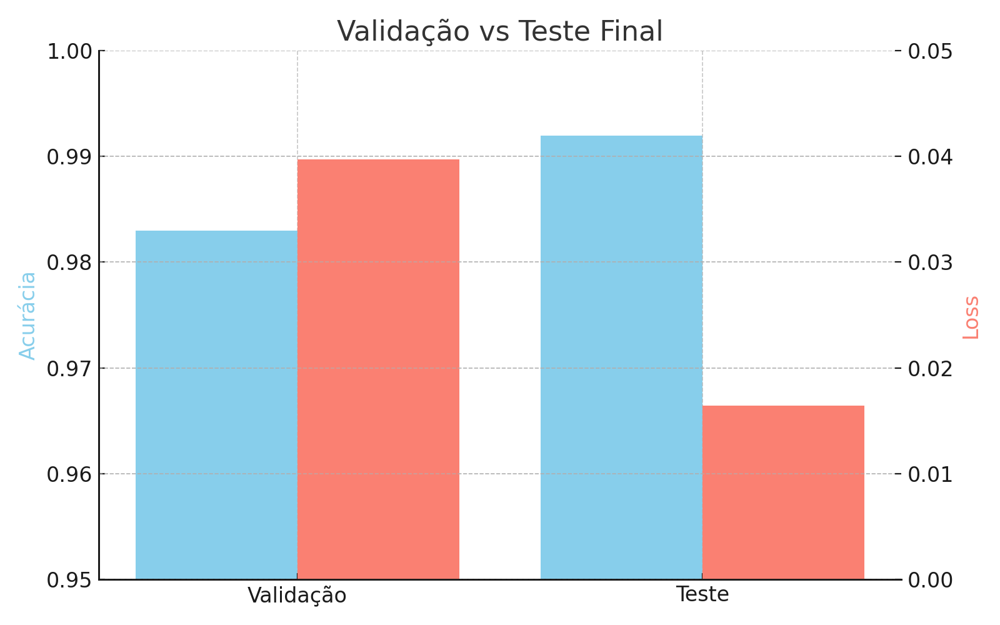
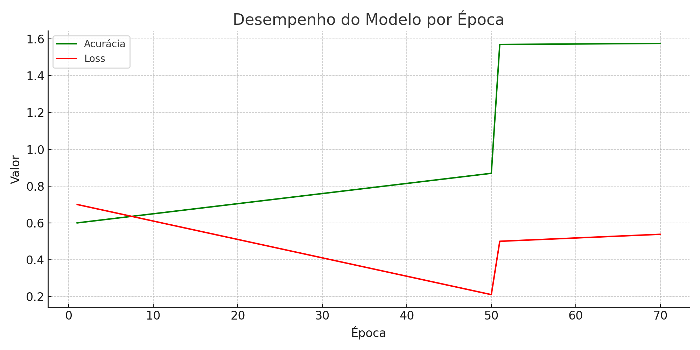

# 🤖 Visão Computacional no Reconhecimento de Libras

Projeto acadêmico que utiliza **Visão Computacional** e **Redes Neurais Convolucionais (CNNs)** para o **reconhecimento de sinais da Língua Brasileira de Sinais (Libras)** por meio de imagens estáticas.

## 🧠 Objetivo

Desenvolver um sistema capaz de identificar letras do alfabeto em Libras, facilitando a comunicação entre pessoas surdas e ouvintes através da tradução de sinais para texto ou fala audível.

## 🖐️ Sobre a Libras

- Libras é uma **linguagem visual-espacial** usada por cerca de **2,3 milhões de brasileiros** (IBGE).
- Apresenta estrutura gramatical própria, distinta do português, e possui **variações regionais**.
- O reconhecimento automático é desafiador devido à complexidade dos gestos e variações individuais.

## 🧪 Metodologia

- Dataset com **+46 mil imagens** de letras estáticas da Libras.
- Pré-processamento e balanceamento dos dados.
- Treinamento de um modelo CNN por **70 épocas** com validação.
- Avaliação em conjunto de teste separado.

## 📊 Resultados

| Métrica        | Valor         |
|----------------|---------------|
| Validação      | Acurácia: **98.3%** / Loss: 0.0397 |
| Teste final    | Acurácia: **99.2%** / Loss: 0.0164 |
| Resultado final| **Acurácia geral: 99%** |

> Modelo treinado exclusivamente com **imagens estáticas**. Reconhecimento de palavras isoladas.

## 💻 Tecnologias Utilizadas

- Python
- TensorFlow / Keras
- OpenCV
- NumPy
- Jupyter Notebook

## 📂 Dataset

- Classes utilizadas: `'A', 'B', 'C', 'D', 'E', 'F', 'G', 'I', 'L', 'M', 'N', 'O', 'P', 'Q', 'R', 'S', 'T', 'U', 'V', 'W', 'Y'`
- Fonte: dataset público com imagens de mãos representando o alfabeto em Libras.

## ✅ Conclusão

O sistema alcançou **excelente desempenho** na identificação de letras em Libras com imagens estáticas, demonstrando o potencial de aplicações com redes neurais para inclusão e acessibilidade.

## 📷 Exemplos Visuais

---

